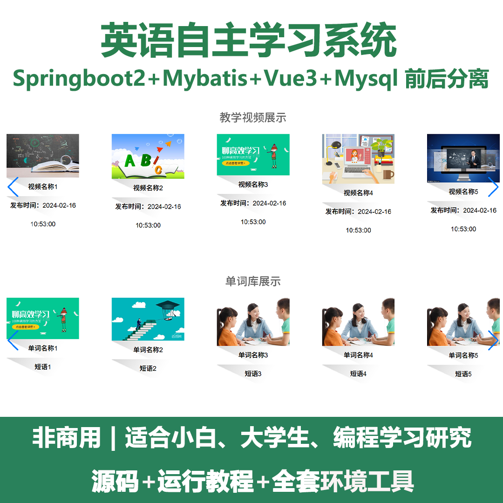
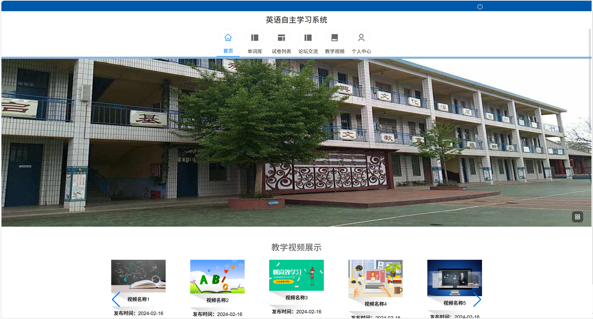
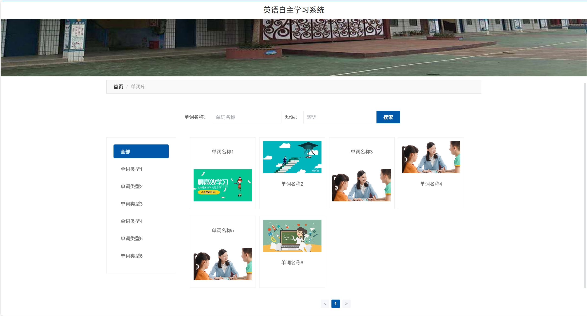
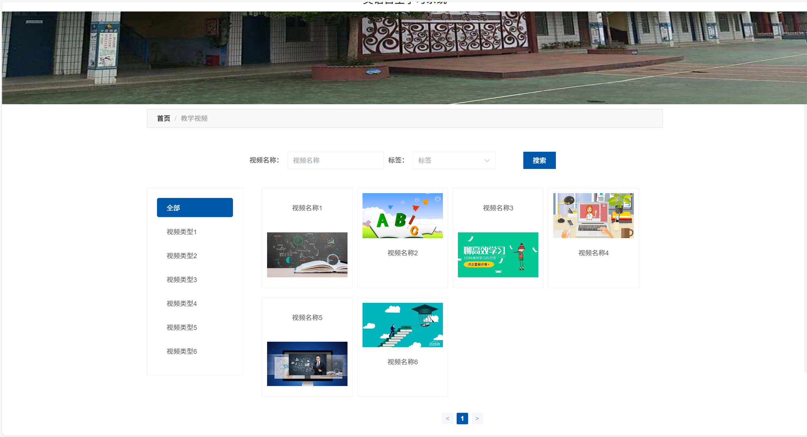
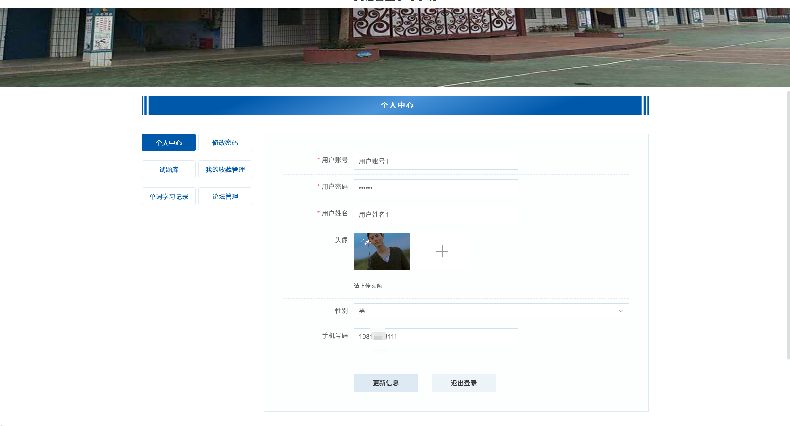
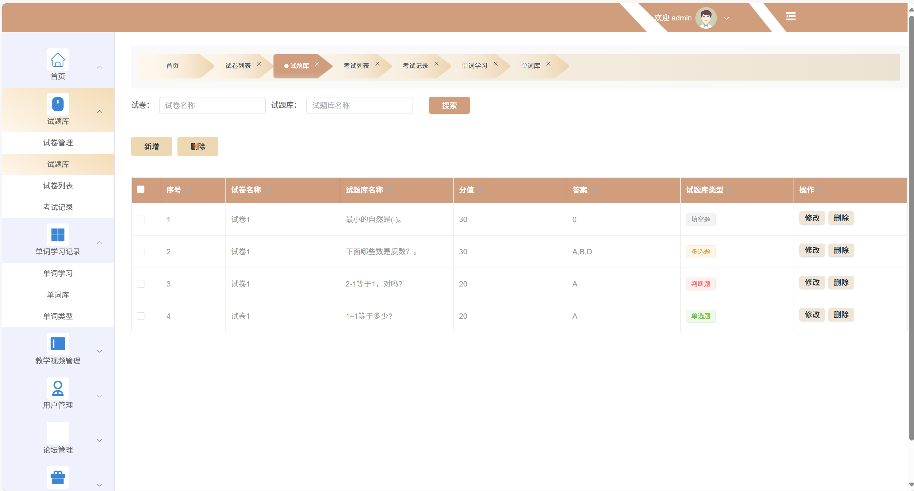
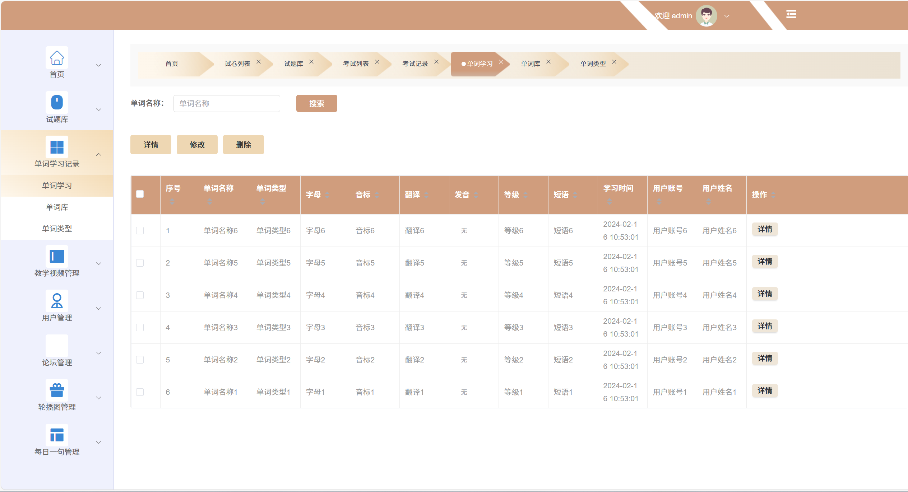
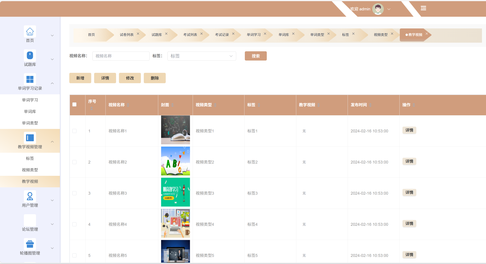
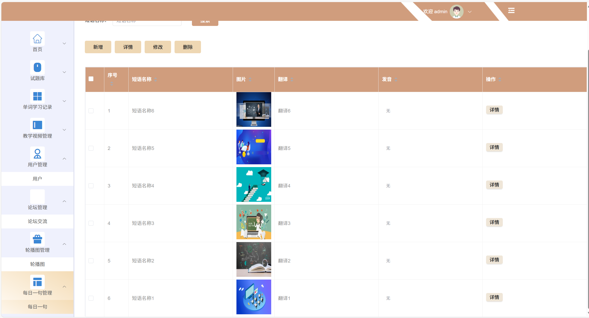

# springbootA543
springbootA543英语自主学习系统（Vue3）
 
## 源码问题查看主页咨询

### 一、关键词
英语自主学习系统，英语自主研习系统，英语自学系统

### 二、作品包含
源码+数据库+全套环境和工具资源+本地部署教程

### 三、项目技术
前端技术：Html、Css、Js、Vue3.0、Element-plus
后端技术：Java、SpringBoot2.0、MyBatis

### 四、运行环境（以下版本亲测，其他版本兼容性请自行测试）
开发工具：IDEA/eclipse  + VSCODE

数据库：MySQL5.7（最低要5.7版本）

数据库管理工具：Navicat10以上版本

环境配置软件： JDK1.8 + Maven3.6.3

前端Nodejs：16

浏览器：谷歌浏览器

### 五、项目介绍
项目编号：springbootA543

英语自主学习系统能帮助学习者自主规划学习进度、针对性强化薄弱环节，高效提升英语综合能力。
首页：展示教学视频和单词库等核心学习资源入口。
单词库：支持按单词名称、短语搜索，可按单词类型分类查看单词。
试卷列表：提供试卷资源，方便用户进行英语测试练习。
论坛交流：为用户提供英语学习交流的社区平台。
教学视频：支持按视频名称、标签搜索，可按视频类型分类查看教学视频。
个人中心：可管理个人信息、修改密码、查看收藏、单词学习记录及论坛管理等。
试题库（管理端）：支持试卷和试题库的搜索、新增、删除及试题的修改删除等管理操作。
单词学习记录（管理端）：可查看用户单词学习的详细信息，包括单词名称、类型、学习时间等，支持搜索、详情、修改、删除操作。
教学视频管理（管理端）：支持教学视频的新增、详情、修改、删除及按名称、标签搜索。
用户管理（管理端）：管理系统用户信息。
论坛管理（管理端）：对论坛交流板块进行管理。
轮播图管理（管理端）：管理系统首页轮播图资源。
每日一句管理（管理端）：管理每日一句的短语资源，包括新增、详情、修改、删除及搜索。

### 六、运行截图

 
